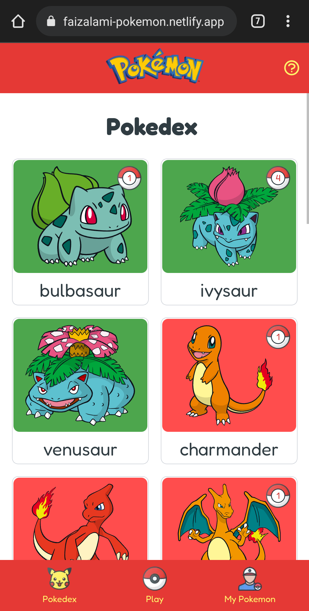
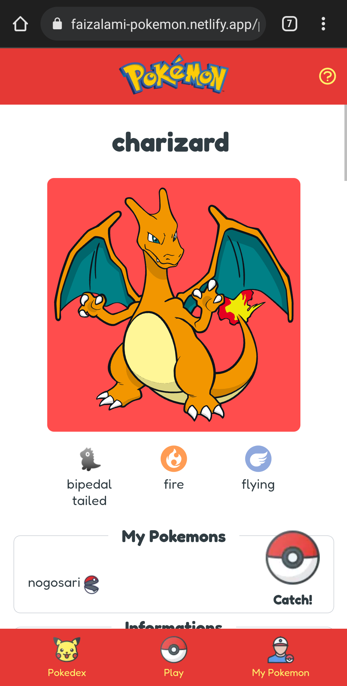
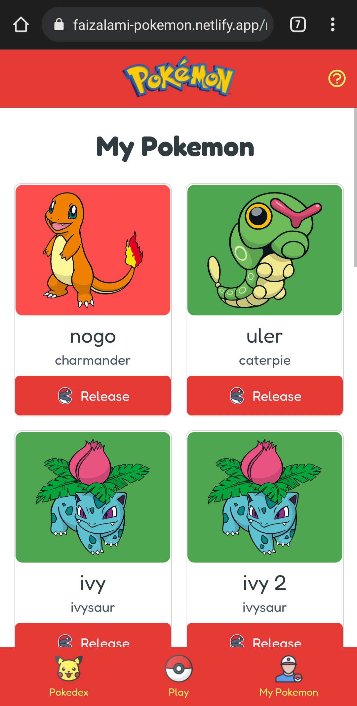
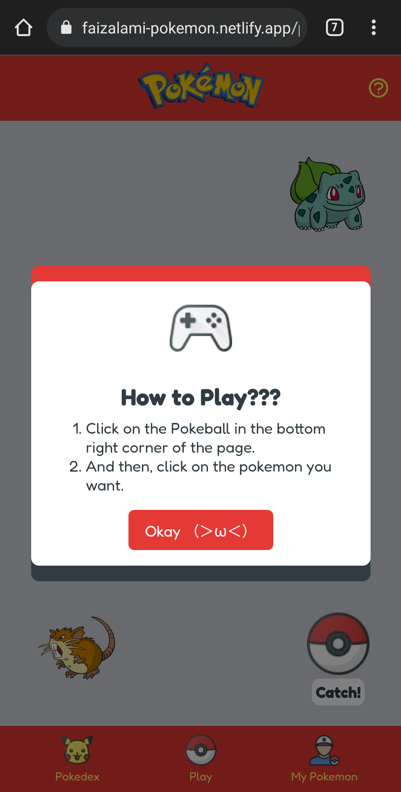

# Pokemon App

A simple pokemon catalogue app with an entertaining simple game. Check the result
in [this link](https://faizalami-pokemon.netlify.app/).

> This web is using [PokéAPI - GraphQL v1beta](https://pokeapi.co/docs/graphql).
> The PokéAPI GraphQL version is in development so maybe someday I should make some changes if the API changed

## Sneak Peek

	
	
	
	

